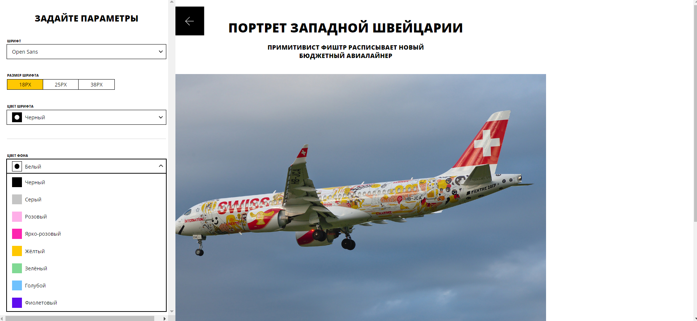

# Проект Blog-customizer

## Описание
Кастомизируемая через открывающуюся панель страница блога.

## Live просмотр

[Перейти на страницу демо](https://blog-custom-3fc8a.web.app/)
  

### Реализовано:

- [x] При нажатии на «стрелку» открывается сайдбар с настройками, при повторном нажатии или клике вне сайдбар закрывается.
- [x] При изменении настроек в сайдбаре они не применяются сразу.
- [x] После нажатия на «применить» стили применяются к статье.
- [x] При нажатии «сбросить» настройки в форме сбрасываются на начальные, которые были при открытии страницы, и стили применяются к статье.
- [x] Настройки устанавливаются через CSS-переменные, которые уже есть в стилях и установлены в коде в дефолтные значения.
